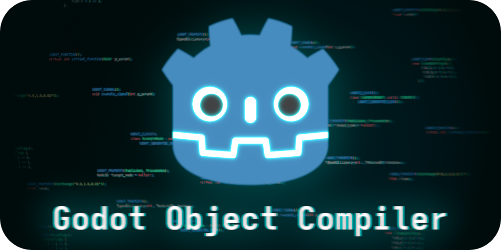

> [!WARNING]
> This is experimental software, please do not use this application in a production environment.



___

<p align='center'>
The Godot Object Compiler is a <b>code generation tool for GDExtensions</b>. It generates bindings and other builderplate code for <b>efficent development in C++</b> while maintaining full configurability via <b>expressive macros</b> generated directly from the godot-cpp source used to build your extension.
</p> 

___


# Example

GOC provides macros that guide the code generator and allows you to expose Godot Object derived classes and their properties, methods and signals to the engine.

### Classes
```cpp
#include "godot_object_compiler/macros.h"
#include "example_node.generated.h"

GODOT_CLASS();
class ExampleNode : public Node3D {
	GODOT_GENERATED_BODY();

    ...
};
```
A class can be marked as a godot class so it is considered by the generators. Within the class body we add a generated body macro. This hook is used by the GOC to inject definitions into the class, such as getters and setters and other additional methods.

### Properties
Next we might want to expose a bunch of properties. If needed we can always provide our own property hints and property usages within the macro parameters. 
```cpp

    GODOT_PROPERTY(HintGlobalDir());
    String global_path;

    GODOT_PROPERTY(HintRange("0.0,1.0,0.01"));
    float range;

```
> [!NOTE]
> GOC provides convenience functions for all possible hint and usage values parsed directly from the godot-cpp library your linking to.

While properties are always public within the engine, we can modify the access specifier of the generated getters and setters for access within our extension.
```cpp

    GODOT_PROPERTY(PublicGet, PrivateSet);
    int cpp_private_property;

```
It is also possible to expose Godot Object types and typed collections.
```cpp

    GODOT_PROPERTY();
    TypedDictionary<int, Texture2D> textures;

    GODOT_PROPERTY();
    Ref<Texture2D> texture;

    GODOT_PROPERTY();
    Node3D *target_node = nullptr;
```

### Signals
If we want to add a signal we add a void method definition and mark it as a signal. This will register the signal with the appropriate method signature and generate an implementation for this method which can be used to emit the signal.
```cpp

    GODOT_SIGNAL();
	void example_signal(int p_param);

```

### Functions
GOC can also expose regular functions to the engine. Virtual and static specifiers are taken into account when generating the bindings. 

```cpp

    GODOT_FUNCTION();
	Node *exposed_function();

	GODOT_FUNCTION();
	virtual int virtual_function(Node *p_param);

	GODOT_FUNCTION();
	static int static_function();

```
> [!NOTE]
> Virtual functions are registered as a script virtual functions, so they can be overwritten in scripts. 

### Enums
Lets say we want to add a flags property to our node. We can add a marked enum to the class body, and specify that we would like this enum to be treated as flags in the macro parameters.
```cpp

    GODOT_ENUM(EnumFlags);
	enum ExampleFlags {
		FLAG_A = 1 << 0,
		FLAG_B = 1 << 1,
		FLAG_C = 1 << 2,
	};

```
Next we add the property. The GOC queries the enum type and generates appropriate code to expose this property with the property hint to bind the enum names and values.
```cpp

    GODOT_PROPERTY();
	ExampleFlags flags = FLAG_A;

```


Last but not least we add a generated global macro outside the class body. GOC uses this hook to generate code that needs to be added in the global namespace such as the enum variant cast macros.
```cpp

GODOT_GENERATED_GLOBAL();

```

# Usage
## CMake Integration

GOC currently ships with **CMake** integration. The tools can be dumped into a local folder by calling the GOC executables init_tools program with a local path argument.
```cmd

<goc_executable> init_tools <path_to_tool_dir>

```

You can then include the tools file in your CMakeLists.txt and activate the GOC generator for your **GDExtension** target by specifying the target name the and sources root directory. GOC will then scan the sources folder on each build and generate the bindings code.
```cmake

include(<path_to_tool_dir>/autogoc.cmake)
...
target_autogoc(<TARGET_NAME> <SRC_ROOT_DIR>)

```

## SConstruct Integration
tbd

## Command Line Usage
tbd

# Mission Statement
Godot is the most popular free and open source game engine to date, democratizing game development and ensuring developers independence from corporate engine offerings.
Commerical game engines aim to bind users into their ecosystem and the company may at any point decide to create exploitative pricing schemes. The conclusion is clear:

---

<p align="center">
    <b>There is no alternative to free and open source software in the games industry.</b>
</p>

---

But there is a reason commercial offerings are preferred by many developers. Commercial game engines offer more features, better graphics, a stable experience, more convenience and asset stores filled to the brim with professional grade assets and plugins ready for use.

While Godot has a healthy plugin ecosystem, there are issues.

1. Godot supports both gdscript and C#, and many plugins are only available in one or the other. The ecosystem is divided.

Native GDExtensions offer better performance. Bindings can be generated for both scripting Languages, but:

2. Developing **C++** extensions can be intimidating and more work intensive. Manual binding of data exposed to the engine stands out as being particualary cumbersome and error prone for developers.

By making native extension development as easy and convenient as possible, aiming for parity in features and ease of usage to the official scripting languages, the **Godot Object Compiler** project facilitates a unified ecosystem of professional grade performant native extensions developed for the Godot game engine, that can be used by game developers regardless of technology choice.

___

<p align="center"><b>Game Devs of the World, Unite!</b></p>