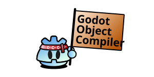

[](./docs/img/logo_header.svg)
___

<p align='center'>
The Godot Object Compiler is a <b>code generation tool for GDExtensions</b>. It generates bindings and other builderplate code for <b>efficent development in C++</b> while maintaining full configurability via <b>expressive macros</b> generated directly from the godot-cpp source used to build your extension.
</p> 

___

[](https://github.com/LucaTuerk/godot-object-compiler/actions/workflows/workflow.yml)
[](https://codecov.io/github/LucaTuerk/godot-object-compiler)
[](https://godot-object-compiler.readthedocs.io/latest/)
[](https://ko-fi.com/lucaiantuerk)

> [!WARNING]
> This is experimental software, please do not use this application in a production environment.
> This project is currently only tested on Linux. Everything is still subject to change.

# Example

GOC provides macros that guide the code generator and allows you to expose Godot Object derived classes and their properties, methods and signals to the engine.

### Classes
```cpp
#include "godot_object_compiler/macros.h"
#include "example_node.generated.h"

GODOT_CLASS();
class ExampleNode : public Node3D {
	GODOT_GENERATED_BODY();

    ...
};
```

A class can be marked as a godot class so it is considered by the generators. Within the class body we add a generated body macro. This hook is used by the GOC to inject definitions into the class, such as getters and setters and other additional methods.

### Properties
Next we might want to expose a bunch of properties. If needed we can always provide our own property hints and property usages within the macro parameters. 
```cpp

    GODOT_PROPERTY(HintGlobalDir());
    String global_path;

    GODOT_PROPERTY(HintRange("0.0,1.0,0.01"));
    float range;

```
> [!NOTE]
> GOC provides convenience functions for all possible hint and usage values parsed directly from the godot-cpp library your linking to.

While properties are always public within the engine, we can modify the access specifier of the generated getters and setters for access within our extension.

```cpp
    GODOT_PROPERTY(PublicGet, PrivateSet);
    int cpp_private_property;

```
It is also possible to expose Godot Object types and typed collections.
```cpp

    GODOT_PROPERTY();
    TypedDictionary<int, Texture2D> textures;

    GODOT_PROPERTY();
    Ref<Texture2D> texture;

    GODOT_PROPERTY();
    Node3D *target_node = nullptr;
```

### Signals
If we want to add a signal we add a void method definition and mark it as a signal. This will register the signal with the appropriate method signature and generate an implementation for this method which can be used to emit the signal.
```cpp

    GODOT_SIGNAL();
	void example_signal(int p_param);

```

### Functions
GOC can also expose regular functions to the engine, and script virtual functions can be bound with a simple tag.

```cpp

    GODOT_FUNCTION();
	Node *exposed_function();

	GODOT_FUNCTION(ScriptVirtual);
	int virtual_function(Node *p_param);

	GODOT_FUNCTION();
	static int static_function();

```

### Enums
Lets say we want to add a flags property to our node. We can add a marked enum to the class body, and specify that we would like this enum to be treated as flags in the macro parameters.
```cpp

    GODOT_ENUM(EnumFlags);
	enum ExampleFlags {
		FLAG_A = 1 << 0,
		FLAG_B = 1 << 1,
		FLAG_C = 1 << 2,
	};

```
Next we add the property. The GOC queries the enum type and generates appropriate code to expose this property with the property hint to bind the enum names and values.
```cpp

    GODOT_PROPERTY();
	ExampleFlags flags = FLAG_A;

```


Last but not least we add a generated global macro outside the class body. GOC uses this hook to generate code that needs to be added in the global namespace such as the enum variant cast macros.
```cpp

GODOT_GENERATED_GLOBAL();

```

# Usage

GOC ships with integrations for [CMake](https://godot-object-compiler.readthedocs.io/latest/integrations/CMake.html) and [SCons](https://godot-object-compiler.readthedocs.io/latest/integrations/SConstruct.html). The tools can be dumped into a local folder by calling the GOC executable's `init tools` program with a local path argument.

```cmd
goc init tools tools
```

## Command Line Usage
You can also use the GOC as a CLI tool to manually generate the sources or build your own integrations. Execute

```cmd
goc help
```

To show usage info or consult the documentation.
